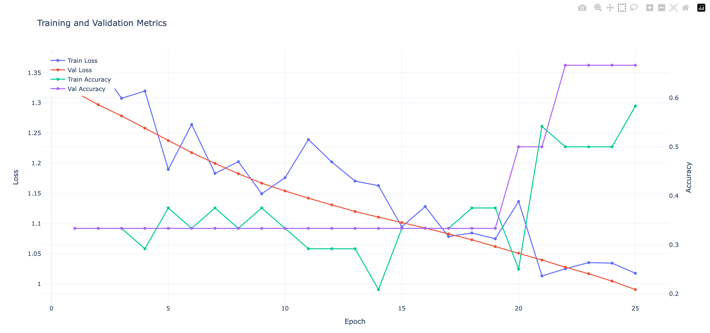
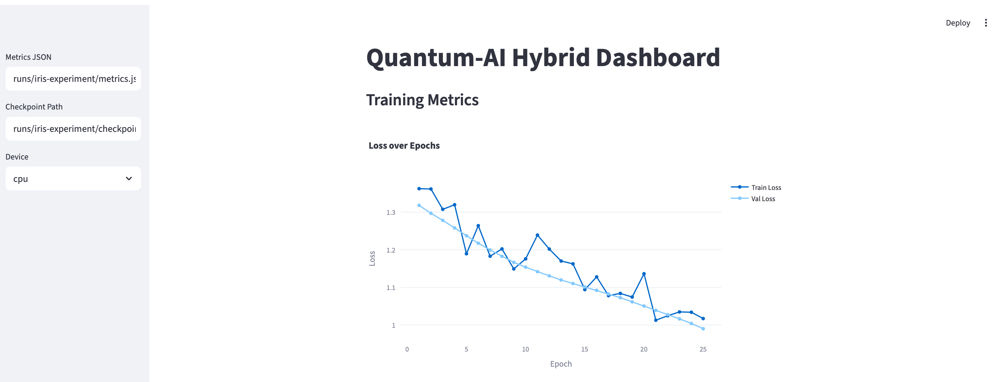
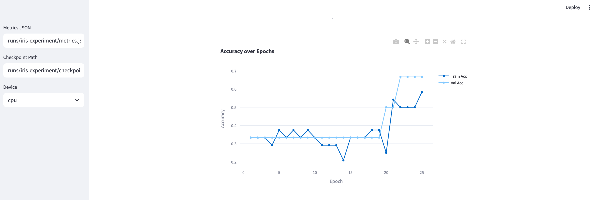
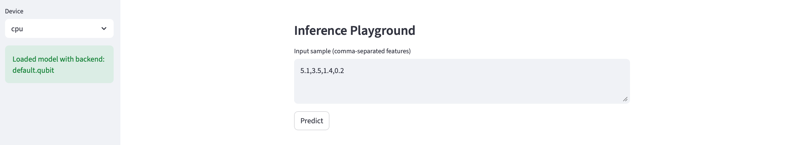
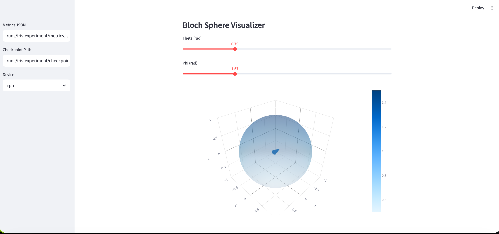

# Quantum-AI Hybrid Cloud Framework  

Quantum-AI Hybrid Cloud Framework is an open-source, modular platform for training and deploying hybrid classical–quantum AI models across CPU, GPU, and QPU environments. Built with PyTorch, PennyLane, and Qiskit, it enables reproducible research and enterprise-ready workflows—from local simulation to cloud quantum hardware (IBM, Rigetti, D-Wave). Fully cross-platform (macOS, Linux, Windows) and optimized for Apple Silicon (MPS), it bridges quantum computing and classical deep learning in a production-grade ecosystem. 


[](https://www.python.org/)
[](https://pytorch.org/)
[](https://pennylane.ai/)
[](https://qiskit.org/)
[](https://fastapi.tiangolo.com/)
[](https://streamlit.io/)
[](LICENSE)

---

## Key Features

  - Hybrid Quantum-Classical Models  
  End-to-end architectures combining classical MLPs with variational quantum circuits (StronglyEntanglingLayers + AngleEmbedding).
  - Universal Hardware Support  
  Auto-detects and runs on CPU, CUDA, Apple MPS, and cloud QPUs—with fallback to local simulators if credentials are missing.
  - Reproducible Experimentation  
  Full random seeding, YAML/CLI configuration, automatic checkpointing, and metric logging (metrics.json).
  - Production-Ready Deployment  
    -  FastAPI REST service (/predict, /health)  
    -  Streamlit dashboard with training metrics, inference playground, and Bloch Sphere visualizer  
   - Model Portability
  Export trained models to TorchScript or ONNX for integration into external systems.
  - Automated CI/CD  
  Validated via GitHub Actions: linting (ruff), unit tests (pytest), and Docker build.
  - Cloud QPU Integration  
  Connect to IBM Quantum, Rigetti, or D-Wave via environment variables—no code changes needed.

---

## Supported Workflows

| Workflow              | Tools / Script                    | Output                                                                 |
|-----------------------|----------------------------------|------------------------------------------------------------------------|
| Training              | `training/train_hybrid.py`       | `runs/<exp>/checkpoints/best.pt`, `metrics.json`, `training_metrics.html` |
| Hyperparameter Search  | Grid over LR, layers, backends   | Per-run directories with metrics                                        |
| Evaluation            | CLI + config                     | Accuracy, F1, confusion matrices                                       |
| Inference             | `deployment/api.py`              | REST API with probabilities & backend info                              |
| Visualization         | `deployment/dashboard.py`        | Interactive loss/accuracy plots + quantum state inspection             |
| Export                | `utils/export.py`                | `model.ts`, `model.onnx`                                               |

---

## Purpose

This framework empowers researchers, educators, and engineers to build, validate, and deploy hybrid quantum-classical AI systems with the rigor of modern MLOps—enabling international collaboration, hardware-aware experimentation, and real-world quantum advantage exploration.

---

## 1. Installation

```bash
# Clone the repository
git clone https://github.com/rasidi3112/Quantum-AI-Hybrid-Cloud-Framework.git
cd Quantum-AI-Hybrid-Cloud-Framework

# Create a virtual environment
python -m venv .venv

# Activate it
source .venv/bin/activate      # macOS / Linux
# OR
.venv\Scripts\activate         # Windows

# Install dependencies
pip install --upgrade pip
pip install -r requirements.txt

# Optional: verify installation
pytest

```
Requirement: Python ≥ 3.11  
"*Tip: Use pyenv or conda if managing multiple Python versions.*"

## 2. Running on Another Laptop or Device
If you want to use the same project on another machine:
1. Clone the repository from GitHub on the new device:
 ```bash
   git clone https://github.com/rasidi3112/Quantum-AI-Hybrid-Cloud-Framework.git
   cd Quantum-AI-Hybrid-Cloud-Framework
```
2. Recreate the virtual environment:
 ```bash
   python -m venv .venv
   source .venv/bin/activate   # or .venv\Scripts\activate

```
3. Install dependencies using the same requirements.txt:
    ```bash
    pip install -r requirements.txt
   ```

4. Restore saved configurations and checkpoints (if you synced them via Git):
  ```bash
     cp -r runs/ /path/to/new/environment/ OR   cp -r runs/ /Users/macbook/Desktop/
  ```
5. Ensure device compatibility:
       
      | Platform                | Recommended --device |
    |-------------------------|-------------------|
    | macOS (Apple Silicon)   | mps               |
    | Windows/Linux (CPU)     | cpu               |
    | NVIDIA GPU              | cuda              |

 
6. Confirm Reproducibility  
Run the following commands to verify that the training process is reproducible (i.e., produces the same results when using the same random seed).
```bash
python -m training.train_hybrid \
  --dataset examples/iris.csv \
  --output outputs/vqc_iris/ \
  --no-mps
```
Then, repeat the experiment with the same configuration and a fixed seed:  
```bash
python -m training.train_hybrid \
  --dataset examples/iris.csv \
  --output outputs/vqc_iris_repeat/ \
  --no-mps \
  --seed 42
```


## 3. Quick Start Training
 ```bash
   python training/train_hybrid.py \
       --model vqc \
       --dataset examples/iris.csv \
       --backend default.qubit \
       --epochs 50 \
       --batch-size 16 \
       --device cpu
```
OR
```bash
python -m training.train_hybrid \
  --dataset examples/iris.csv \
  --output outputs/vqc_iris_long/ \
  --backend default.qubit \
  --epochs 50 \
  --batch-size 16 \
  --no-mps
```
Output:
- runs/<experiment_name>/checkpoints/best.pt
- runs/<experiment_name>/metrics.json
- Training plots (loss, accuracy)

 ### Training Metrics Visualization

After running the training command, the framework automatically generates `training_metrics.html` under the `runs/<experiment_name>/` directory.  
This file provides a real-time visualization of loss and accuracy curves during training.

Example output:



To train on a QPU:
```bash
# 1. Set your IBM Quantum API token (required for cloud access)
export QAI_IBM_TOKEN="your_actual_ibm_quantum_token"

# 2. Run training with a real QPU backend (e.g., ibmq_manila)
python training/train_hybrid.py \
  --dataset examples/iris.csv \
  --output runs/qpu-test \
  --backend ibmq_manila \
  --device cpu \
  --epochs 5 \
  --batch-size 8 \
  --shots 1024
```
"*Note: Replace ibmq_manila with any IBM QPU you have access to (e.g., ibmq_lagos, ibmq_quito).*"    
Use --device cpu because quantum execution happens remotely; the classical part runs on your local CPU.  

1. Backend Resolution in utils/hardware.py
   Your code explicitly handles IBM backends:
   ```bash
   elif backend_lower.startswith("ibm"):
    token = os.getenv("QAI_IBM_TOKEN")
    if token:
        service = QiskitRuntimeService(channel="cloud", token=token)
        device = qml.device("qiskit.ibmq", wires=n_wires, backend=backend_name, shots=shots or 1024, service=service)
        info = QuantumBackendInfo(name=backend_name, is_hardware=True, provider="IBM", shots=shots or 1024)
        return device, info
    else:
        # Fallback to local simulator
        device = qml.device("default.qubit", wires=n_wires, shots=shots)
   ```
   This confirms:

    - The framework reads QAI_IBM_TOKEN from environment variables.  
    - If the token exists and the backend name starts with "ibm", it connects to real IBM hardware or simulators via Qiskit Runtime.  
    - If no token, it safely falls back to default.qubit.
      
 2. CLI Argument Parsing in training/train_hybrid.py
      The --backend argument is directly passed to TrainingConfig, which is used in QuantumLayerConfig:
    ```bash
    quantum_config = QuantumLayerConfig(
    n_qubits=classical_config.output_dim,
    n_layers=config.quantum_layers,
    backend=config.backend,      # ← comes from --backend
    shots=config.shots,)
     ```
3. No --use-qpu Flag Exists  
   Your code does not use a --use-qpu True flag. This is a legacy artifact from documentation or another project (e.g., Quantum-Machine-Learning).  
→ Remove --use-qpu True — it will cause an "unrecognized argument" error.

Valid Backend Examples:  


| Backend Type        | Command Example             | Notes |
|----------------------|-----------------------------|-------|
| IBM Quantum Simulator | `--backend ibmq_qasm_simulator` | Fast, no queue, good for testing |
| IBM Real QPU          | `--backend ibmq_manila`         | Requires active IBM account and access |
| Local Simulator       | `--backend default.qubit`       | No token needed, runs offline |

"*Important: Real QPUs often have long queue times and limited availability. Start with ibmq_qasm_simulator for validation.*"

Summary: What You Should Use  
  For IBM Quantum Simulator (recommended for testing):  
  ```bash
    export QAI_IBM_TOKEN="your_token"
python training/train_hybrid.py --dataset examples/iris.csv --backend ibmq_qasm_simulator --device cpu --epochs 10
```
  For Real IBM QPU (if you have access):  
  ```bash
    export QAI_IBM_TOKEN="your_token"
python training/train_hybrid.py --dataset examples/iris.csv --backend ibmq_manila --device cpu --epochs 5 --shots 8192
```
  For Local Simulation (no token needed):  
  ```bash
    python training/train_hybrid.py --dataset examples/iris.csv --backend default.qubit --device cpu --epochs 10
```


## 4. Evaluation and Inference
```bash
  python -m training.train_hybrid evaluate \
    --checkpoint runs/iris-hybrid/checkpoints/best.pt \
    --dataset examples/iris.csv
```
The evaluation script automatically detects available devices and logs performance metrics to runs/<experiment>/metrics.json.

## 5. Deployment (FastAPI & Streamlit) 
   FastAPI REST Service
   ```bash
python -m deployment.api \
    --model-path runs/iris-hybrid/checkpoints/best.pt \
    --device cpu \
    --host 0.0.0.0 \
    --port 8000
```
   Endpoints:
   -GET /health → { "status": "ok", "backend": "default.qubit" }
   -POST /predict → send JSON samples and receive predictions.
   Example:
 ```bash
{
  "samples": [[5.1, 3.5, 1.4, 0.2]]
}
```

   Response:  
   ```
    {
"predictions": [0],
  "probabilities": [[0.95, 0.03, 0.02]],
  "backend": "default.qubit"
}

```

Streamlit Dashboard:

 ```bash
streamlit run deployment/dashboard.py

```
#### Dashboard Screenshots

**1. Overview: Training Metrics**
  
*Real-time visualization of training metrics (loss & accuracy) across epochs. On Mac Apple Silicon, the MPS device is automatically used if selected.*

  
*Detailed metrics and logs. Device selection (CPU/MPS/CUDA) ensures consistent cross-platform performance.*

**2. Inference Playground**
  
*Interactive input interface for predictions. Choose device according to your hardware for optimal inference speed.*

**3. Bloch Sphere Visualizer**
  
*Quantum state visualization using a Bloch Sphere. Accelerated on MPS (Apple Silicon) or CUDA (NVIDIA GPU).*

This dashboard provides:
- Real-time training metrics visualization.
- Quantum state plots (Bloch Sphere).
- Model inference playground.
  
## 6. Export and Integration
 ```bash
   # Export to TorchScript (PyTorch ecosystem)
python -m utils.export \
    --checkpoint runs/iris-hybrid/checkpoints/best.pt \
    --torchscript exports/model.ts

# Export to ONNX (TensorRT, ONNX Runtime, etc.)
python -m utils.export \
    --checkpoint runs/iris-hybrid/checkpoints/best.pt \
    --onnx exports/model.onnx
```
  These exported models can be used for deployment in other frameworks or cloud environments.

  ## 7. Docker (Universal Runtime)
  ```bash
   # Build
docker build -t quantum-ai-hybrid .

# Run (mount checkpoints if needed)
docker run -it -p 8000:8000 \
  -v $(pwd)/runs:/app/runs \
  quantum-ai-hybrid \
  --model-path runs/iris-hybrid/checkpoints/best.pt \
  --device cpu

 "Ideal for: Cloud deployment, CI/CD, and environment isolation." 
```
 ## 8. GitHub Actions are configured for:
- Linting (flake8)
- Unit tests (pytest)
- Automatic Docker build validation

 ## 9. Directory Structure
 ```bash
Quantum-AI-Hybrid-Cloud-Framework/
├─ .github/workflows/   # CI/CD pipelines: automated testing, linting, Docker build
├─ deployment/          # FastAPI services and Streamlit dashboard scripts
├─ examples/            # Sample datasets, notebooks, and usage examples
├─ models/              # Hybrid and quantum model definitions (PyTorch + PennyLane/Qiskit)
├─ training/            # Training pipeline scripts and utilities
├─ utils/               # Logging, checkpointing, device utilities, and helper functions
├─ tests/               # Unit and integration tests for reproducibility
├─ runs/                # Experiment outputs: checkpoints, metrics, and visualizations
└─ requirements.txt     # Python dependencies for reproducible environment

```
 ## 10. Cloud Integration
To connect to a cloud quantum provider, export your credentials:
  ```bash
# IBM Quantum
export QAI_IBM_TOKEN=<your_ibm_token>

# Rigetti
export QAI_RIGETTI_KEY=<your_rigetti_key>

# D-Wave
export QAI_DWAVE_KEY=<your_dwave_key>
 ```
The framework automatically falls back to the local simulator if credentials are not provided.

 ## 11. Multi-Device Synchronization (Best Practice)

- Keep all configurations (config/), checkpoints (runs/), and requirements.txt versioned in Git.
- Always recreate virtual environments per device.
- Use consistent Python version (>=3.11).
- To ensure reproducibility, set random seeds via config/training.yaml or CLI flag --seed.
- For Apple Silicon users, prefer --device mps over CPU for optimal performance.

## 12. License
   This project is licensed under the MIT License, allowing modification and commercial use with proper attribution.  


   ---


   ### Notes  
   
    This repository is under active development.  
    Some modules may still produce unstable results on QPU backends due to noise or interface updates in PennyLane/Qiskit.  
    We welcome pull requests and issue reports.  
    
    
      
